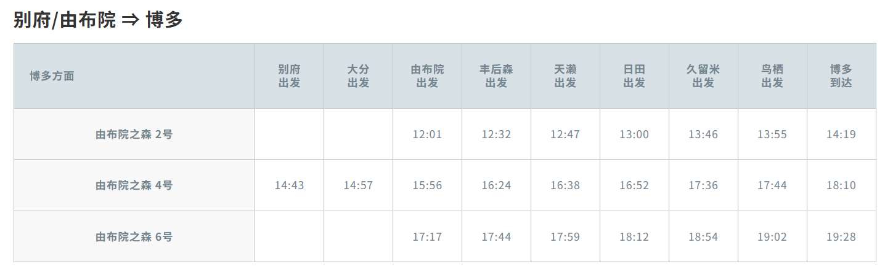

# Japan-traffic

## 北九州JR 

### JRpass
- 3日券：**15000(NT$3044)**
- 5日券：**17000(NT$3450)**

### JR單程
* 博多=>熊本：
- **新幹線**普通車自由席：**4700(NT$954)**	
- **新幹線**普通車指定席：**5230(NT$1061)**	
			 
* 久留米=>博多：
- **新幹線**普通車自由席：**1740(NT$353)**
- **新幹線**普通車指定席：**2790(NT$566)**
- *普通JR*鹿児島本線：**870(NT$176)**
			

### 由布院之森：全車皆為指定席
1,3,5號為去程列車，2,4,6號則為回程列車
*3、4*為多車廂

由布院=>博多：{
			由布院之森3號全車指定席：**6130(NT$1244)**
			網上優惠（九州ネットきっぷ）：**5600(NT$1136)**
			}
			
## 福岡悠遊卡
一天內不限次數搭乘**巴士，電車，地下鐵，船舶**等。除了交通設施的優惠外，在參觀某些設施時也可享有**折扣優惠**。

- 福岡市版：**2500(NT$507)**
- 福岡市+太宰府(西鐵電車：雜餉隈-二日市站-太宰府)：**2800(NT$568)**

## SunQ Pass無限乘坐巴士券
覆蓋2400多條線路，包括高速巴士和本地巴士

- 北九州巴士乘車券2日：**NT$1610**
- 北九州巴士乘車券3日：**NT$2012**

